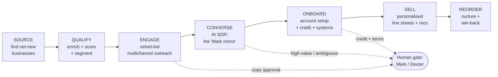

# The Febland Sales Factory

An automated production line that takes new-customer sales **out of Mark's hands** — sourcing,
qualifying, engaging, conversing, onboarding, selling and reordering run as a pipeline of AI
agents, coordinated by a central "brain" that encodes how Dexter runs the sales side.

> **Design principle:** the line is fully automated; humans sit at a few **approval gates** at the
> risky seams (outbound copy, credit terms, big quotes, ambiguous replies). We widen those gates as
> the system proves itself. Build gated → remove gates with evidence → reach full autonomy safely.

Mark's role inverts: from the bottleneck who does everything, to the closer who only handles
high-value deals and relationships. The machine does the volume.

---

## The production line



| # | Station | Agent | Input → Output | Automatable? |
|---|---------|-------|----------------|--------------|
| 1 | **Source** | Prospector | seed criteria → net-new businesses (deduped vs existing 500) | Full |
| 2 | **Qualify** | Analyst | business → enriched, scored, segmented record | Full |
| 3 | **Engage** | Opener | qualified record → sent velvet-led sequence (email + LinkedIn) | Full *(gate: copy approval early on)* |
| 4 | **Converse** | SDR ("Mark mirror") | reply → answered, catalogue sent, call booked, objection handled | Full *(gate: high-value / ambiguous)* |
| 5 | **Onboard** | Onboarder | interested buyer → trade account, credit terms, systems set up, welcome | Semi *(gate: credit + terms)* |
| 6 | **Sell** | Merchandiser | new account + preferences → personalised line sheet + recommendations | Full |
| 7 | **Reorder** | Account-keeper | account history → reorder nudges, upsell, win-back | Full |

---

## The central brain (the Dexter-mirror)

Three parts working together:

### 1. Memory — the single source of truth
One CRM/database holding every prospect and account: pipeline **state**, segment, preferences,
order history, and full conversation log. Every station reads and writes here. Nothing lives in a
person's head or inbox.

**Pipeline state machine** (each record moves through this):
```
DISCOVERED → ENRICHED → QUALIFIED → ENGAGED → REPLIED → IN_CONVERSATION
          → ONBOARDING → ACTIVE_ACCOUNT → REORDER/NURTURE
    (branches: DISQUALIFIED · SUPPRESSED/opted-out · DORMANT)
```

### 2. Rules — Dexter's judgement, written down
The `brain/` folder. These documents ARE the AI's decision-making — fill them in and the agents
stop being generic and start deciding like Febland:
- `01-ideal-customer.md` — who we chase and who we don't (ICP + red lines)
- `02-qualification.md` — how we score fit and decide to pursue
- `03-pricing-and-terms.md` — discount tiers, MOQs, credit policy, what needs sign-off
- `04-brand-voice.md` — how Febland sounds; do's and don'ts
- `05-product-knowledge.md` — the velvet hero range + catalogue overview + what to lead with per segment
- `06-objection-handling.md` — the real objections and the winning responses

### 3. Orchestrator — next-best-action + escalation
Runs on **n8n** (you already have it). For each record it asks Claude: *given this record's state,
history and the rules, what's the next best action — and do I have authority to take it, or does it
hit a gate?* Then it either executes or routes to a human.

---

## Tech stack (builds on what you already have)

| Layer | Tool | Notes |
|-------|------|-------|
| Orchestration | **n8n** | Already in use — becomes the factory's conveyor belt |
| Reasoning (the agents) | **Claude API** | Called from n8n at each reasoning station |
| Memory / CRM | **TBD — decision needed** | HubSpot (free tier, strong B2B) or Airtable (flexible, cheap) — see questions |
| Commerce | **Shopify · WooCommerce · Faire** | Brain reads catalogue + writes orders/accounts |
| Comms | Dedicated sending domain (warmed) + LinkedIn + optional WhatsApp | Deliverability is make-or-break |
| Enrichment | Companies House (free) · Google Places · optional Apollo/Hunter | Verified contacts only — no guessing |
| Compliance | PECR / UK-GDPR legitimate interest, easy opt-out, suppression log | Baked into the Engage + Converse stations |

---

## Build roadmap (phased — each phase removes one bottleneck)

- **Phase 0 — Foundations** *(now)*: fill the `brain/`; prospecting engine live *(prototype done)*;
  stand up the CRM; set up the sending domain.
- **Phase 1 — Top of funnel**: Source + Qualify + Engage automated. Human approves copy; replies go
  to Mark. *Removes the "finding & first-touch" bottleneck.*
- **Phase 2 — The Mark mirror**: Converse agent handles replies, FAQs, sends line sheets, books
  calls; human only on high-value/ambiguous. *Removes the "responding" bottleneck.*
- **Phase 3 — Onboarding**: account application, credit-check integration, WooCommerce/Faire
  provisioning, welcome pack — automated with a credit gate.
- **Phase 4 — Selling brain**: personalised recommendations + reorder/win-back engine per account.
- **Phase 5 — Widen autonomy**: brain runs the line; humans handle exceptions & relationships only.

Each phase is independently useful — you get value at Phase 1, you don't wait for Phase 5.

---

## What unblocks the next step
1. Fill in the `brain/` templates (or hand me the raw info and I'll draft them for your sign-off).
2. Pick the CRM (HubSpot vs Airtable).
3. Confirm which gates you want to keep human at the start (see architecture default above).
